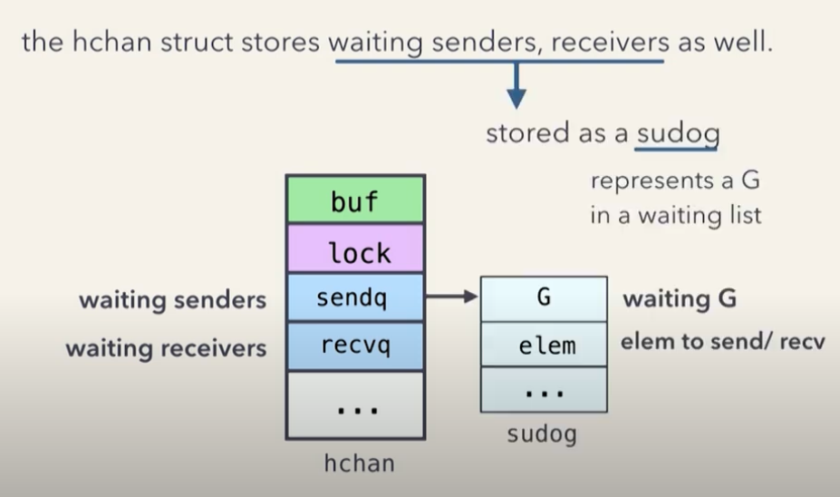
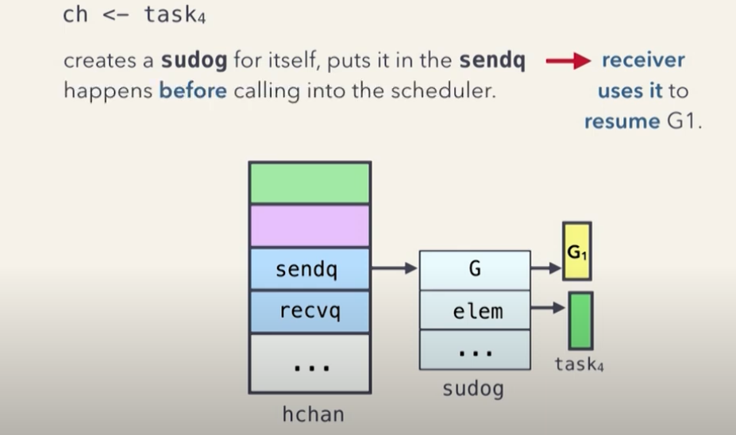
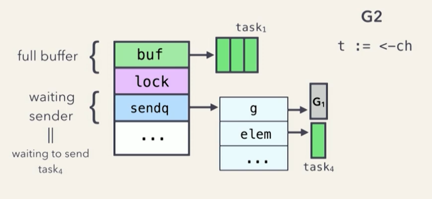
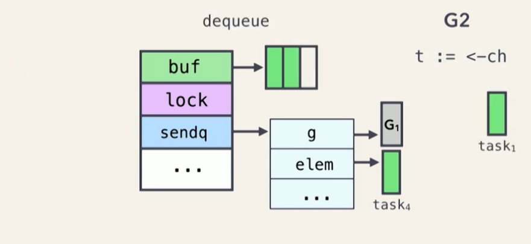
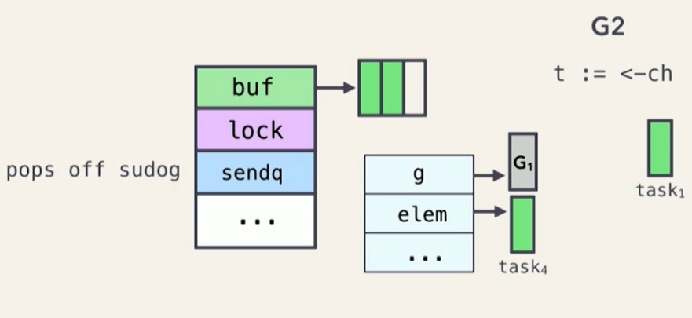
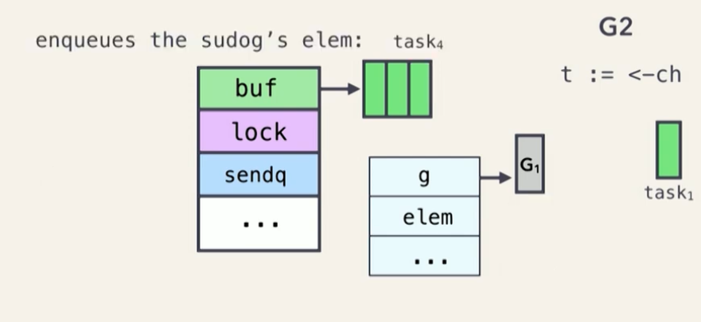
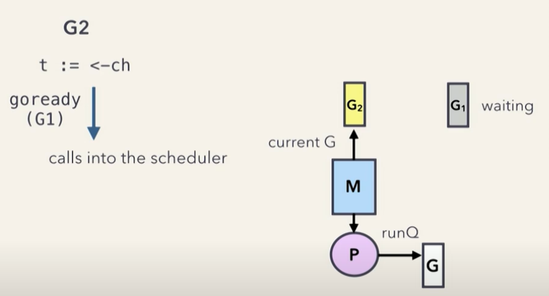
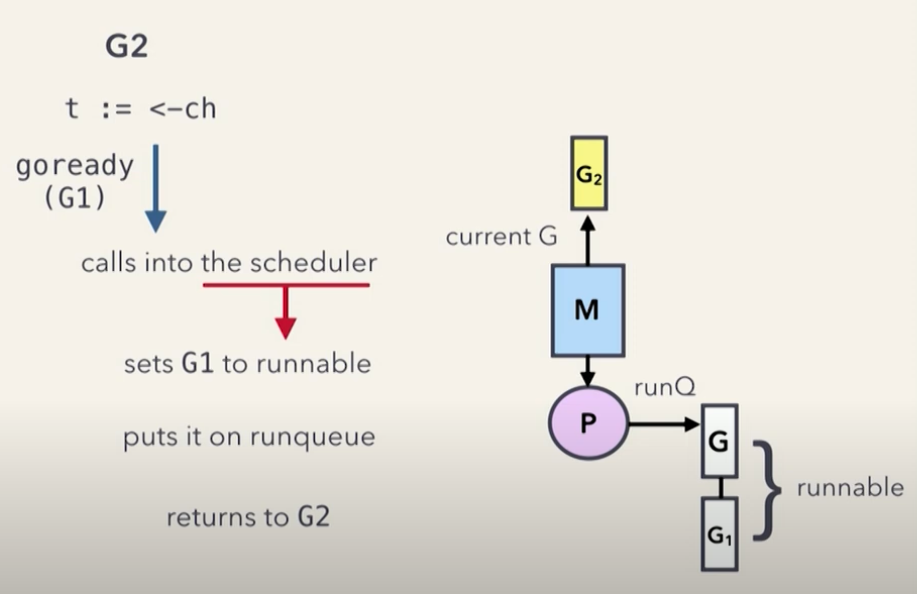

# Index
- [Concurrency](#concurrency)
- [Parallelism](#parallelism)
- [Channels](#channels)
   * [Capacity](#capacity)
- [Runtime Scheduler](#runtime-scheduler)
   * [Key Components of Go’s Scheduler](#key-components-of-gos-scheduler)
      + [How They Work Together](#how-they-work-together)
      + [2️⃣ ¿Por qué puede haber más M que P?](#2-por-qué-puede-haber-más-m-que-p)
- [Blocking OS Threads](#blocking-os-threads)
- [Fork-Join Model](#fork-join-model)
   * [Fork](#fork)
   * [Join](#join)
   * [Pattern](#pattern)
   * [🔍 Fork-Join Model vs Fork-Join Pool](#-fork-join-model-vs-fork-join-pool)
- [Communicating Sequential Processes - CSP](#communicating-sequential-processes-csp)
   * [Synchronization](#synchronization)
      + [Common synchronization tools:](#common-synchronization-tools)
   * [Guarded Commands](#guarded-commands)
- [Pool](#pool)
   * [What is sync.Pool](#what-is-syncpool)
- [Single-Thread](#single-thread)
   * [🔹 Razón principal:](#-razón-principal)
- [Thread Pool](#thread-pool)
   * [🚦 ¿Por qué usar un Thread Pool?](#-por-qué-usar-un-thread-pool)
   * [Golang](#golang)
      + [🟢 Go usa un modelo M:N (Multiplexing)](#-go-usa-un-modelo-mn-multiplexing)

https://www.youtube.com/watch?v=S-MaTH8WpOM&ab_channel=Hypermode
8:00

Concurrency is about MANAGING multiple task at once, parallelism is about EXECUTING multiple tasks at once

# Concurrency

- Program that can handler multiple task.
- Performing many tasks in a single CPU Core, create the illusion that tasks are progressing simultaneously, but really not

# Parallelism

- Simultaniean executions.
- Multiple task can be processed simultained, using multiples CPU cores.

# Channels
- goroutine-safe
- stores up to  capacity elements, and provides FIFO semantics
- send values between goroutines
- can cause them to block, unblock


- affter the first , sendx to 1
- when the channel is full, sendx to 0 again


- when you recive a message


```go
// buffered channel
ch := make(chan Tash, 3)

// unbuffered channel
ch := make(chan int)
```

The channels are stored in the heap, returns a pointer to it.<br />
This is why we can pass channels between functions, dont need to pass **pointers to channels**


<br />

<br />
(user-space threads) Goroutines are created and managed by the Go runtime, NOT the OS (os threads)

- user-space threads is less expensive with respecto to resource consumption and scheduling
- the runtime scheduler schedules them onto OS threads

## Capacity
```go 
make(chan *string, 20) // capatiyy of 20
```

affter the channel is closed we cant send anyrhing to the channel but we can recive values


https://www.youtube.com/watch?v=RlM9AfWf1WU&ab_channel=ByteByteGo

# Runtime Scheduler
The Go runtime manages goroutines using a M:N scheduler, meaning that M goroutines are scheduled onto N OS threads. This allows Go to run a huge number of goroutines efficiently, compared to using OS threads directly.

- Go routines start with just 2kb of memory, but have growable stacks

- M (Goroutines) → N (Threads) → CPU Cores
Go schedules many goroutines on fewer OS threads, which are mapped to CPU co

The scheduler is designed to:

- Minimize context switching.
- Distribute goroutines across available CPU cores.
- Avoid blocking OS threads whenever possible.


<br />

<br />

<br />


## Key Components of Go’s Scheduler
Go’s scheduler consists of three main components:

- G (Goroutine): A lightweight thread managed by Go.
- M (Machine): Represents an OS thread.
- P (Processor): Manages a set of goroutines and is assigned to an OS thread (M).

### How They Work Together

- Each P (Processor) runs a queue of goroutines.
- M (Threads) execute goroutines from P.
- When a goroutine blocks (e.g., waiting for I/O), the scheduler moves other goroutines to another available P.
    - each OS thread (M) is assigned exactly one processor (P) at a time, but there can be more processors than threads.
    - 1 M (OS thread) → 1 P (Processor) (An OS thread always runs under a processor)
    - M (Threads) ≥ P (Processors) (There can be more OS threads than processors)
    - Siempre hay exactamente 1 P por cada M en ejecución activa.
    - Puede haber más M que P porque algunos M pueden estar bloqueados.
    - Go crea más M cuando hay bloqueos, para seguir ejecutando otros goroutines.
- The GOMAXPROCS setting controls the number of P (and thus how many CPU cores are used).

### 2️⃣ ¿Por qué puede haber más M que P?

Hay situaciones en las que Go necesita crear más **M** (OS threads) aunque no tenga suficientes **P** disponibles.

**🔹 Caso 1: Bloqueo por llamadas al sistema**
<br />
Si un goroutine dentro de un **M** (OS thread) llama a una operación **bloqueante**, como:

- **I/O** (leer un archivo, una red, una base de datos)
- **Syscalls largas** (esperar entrada de usuario, un mutex del sistema, etc.)

Entonces:

1. Ese **M** se bloquea.
2. Su **P** queda libre y se reasigna a otro **M**.
3. Si no hay suficientes **M** activos para ejecutar otros goroutines, **Go crea un nuevo M**.

➡️ **Ahora hay más M que P, porque hay M bloqueados esperando a que su syscall termine.**

**🔹 Caso 2: Goroutines que usan Cgo**<br />
Si un goroutine llama a una función en **C** (usando Cgo):

1. El código **C** bloquea el thread (**M**), pero no devuelve el control al scheduler de Go.
2. **Go crea otro M** para seguir ejecutando otros goroutines.

➡️ **De nuevo, más M que P.**

# Go routines

```go
type g struct {
    // The goroutine's stack information (low and high addresses)
    stack       stack        // Stack bounds

    // Current M (machine / thread) running this G, or nil if not running
    m           *m           // Associated M executing this goroutine

    // Scheduler-related info: PC/SP to resume execution, goroutine status, etc.
    sched       gobuf        // Goroutine scheduler state (used when paused)

    // The goroutine's status in an atomic form for safe concurrent access
    atomicstatus atomic.Uint32  // Atomic access to g.status, for race-free ops

    // Goroutine ID (goid), useful for debugging
    goid        int64        // Unique ID assigned to this goroutine

    // Entry point function for the goroutine
    startpc     uintptr      // PC where goroutine starts (used for tracing/debugging)

    // Parameter passed to the goroutine function (e.g., in go func(x))
    param       unsafe.Pointer  // Function argument

    // If the goroutine is panicking, this points to the panic structure
    panic       *panic       // Active panic state, if any

    // Linked list of deferred function calls (used by `defer`)
    _defer      *_defer      // Deferred calls list

    // If the goroutine is blocked on a channel, this points to it
    parkingOnChan *hchan     // Channel goroutine is parking on (e.g., <-ch)

    // If non-nil, indicates this G is active in the select case for stacks
    activeStackChans bool    // Used by stack scanning & channel logic

    // Status of the goroutine (Grunnable, Grunning, Gwaiting, etc.)
    status      uint32       // Goroutine status (non-atomic, use atomicstatus)

    // ... Other fields omitted for brevity
}
```

## Goroutine stack

- All goroutines are initially allocated 2kb of memory

- Each go function has a small preamble, wich calls **morestack** if it runs out of memory

- Then, the runtime allocates a **new memory segment** with **doble the size**, and copies over the old segment and restarts execution (and free the old memory)

- Effectively, makes goroutines **infinitely growable**! with efficient shrinking

# Blocking OS Threads
Goroutine is blocked as needed, but not the OS thread.
<br />
The channel struct stores waiting senders, receivers as well.
<br />

<br />

<br />

<br />

<br />

<br />

available to recive tasks
<br />

<br />


# Fork-Join Model

The Fork-Join model is a parallel programming pattern used to break a big task into smaller subtasks that can be done concurrently, and then combined to get the final result.

It’s widely used in divide-and-conquer algorithms, multithreading, and parallel processing.

## Fork
You split (fork) the main task into smaller, independent subtasks, and run them in parallel (e.g., using threads, goroutines, or processes).

## Join
You wait (join) until all the subtasks are done, then combine their results to produce the final output.

## Pattern
It's a pattern commonly used in parallel processing, like in divide-and-conquer algorithms (e.g. parallel mergesort, image processing, etc.)
<br />


## 🔍 Fork-Join Model vs Fork-Join Pool

- Can be mimicked in Go using goroutines + channels + worker pools


| Concept      | Fork-Join **Model**             | Fork-Join **Pool**                      |
|--------------|----------------------------------|------------------------------------------|
| What it is   | A pattern or strategy            | A system to implement the pattern        |
| Level        | High-level idea                  | Practical tool/framework                 |
| Example      | "Split task, run subtasks, join" | Java's `ForkJoinPool` class              |
| Usage        | Theory or any language           | Java or other specific platforms         |

---


- **Fork-Join model** is the recipe  
- **Fork-Join pool** is the kitchen appliance that makes it easier to cook that recipe

# Communicating Sequential Processes - CSP
It’s a formal way to describe how independent processes (tasks) communicate and coordinate with each other through channels.

- Each process runs sequentially (like a regular function).

- Processes don’t share memory.

- Instead, they communicate by sending messages through channels.

- Synchronization happens when one process sends a message and another receives it — they must "meet" at the channel.

```go
ch := make(chan string)

go func() {
    ch <- "hello" // sends data
}()

msg := <-ch // receives data
fmt.Println(msg)

// No shared memory.

// Communication is synchronized at the channel.

// If the receiver isn’t ready, the sender blocks, and vice versa.
```

2 main concepts: Synchronnization and Guarded Commands

## Synchronization
Synchronization means making sure that multiple threads or processes don’t step on each other’s toes — especially when accessing shared resources like variables or memory.

Why do we need it?
To avoid data races, inconsistencies, crashes, etc.

### Common synchronization tools:
- Locks / mutexes: Only one thread can access a resource at a time.

- Semaphores: Counted locks, controlling access to a pool of resources.

- Barriers: Threads wait until all reach a point.

- Channels (in CSP): Implicit synchronization through communication.

```go
let counter = Arc::new(Mutex::new(0));

let handle = thread::spawn({
    let counter = Arc::clone(&counter);
    move || {
        let mut num = counter.lock().unwrap(); // synchronized access
        *num += 1;
    }
});
```

## Guarded Commands
Used to control the execution flow in concurrent or non-deterministic programs.
A guard is a boolean condition (true or false) that controls whether a certain block of code can execute.

In CSP, you can model programs that wait on multiple possible inputs, and choose based on availability. For example:

```go
select {
case msg := <-ch1:
    // do something with msg
case msg := <-ch2:
    // do something else
}
```

This Go select statement is very much like guarded commands — each channel read is a guard, and only one case executes depending on which channel is ready.

- Each case waits only if the channel is ready.

- If multiple channels are ready, Go picks one at random → non-determinism.

- If no guards are true (no channels ready), the default acts like a "fallback guard". If we have a default

# Pool

sync.Pool in Go is a structure for efficiently reusing objects and reducing the overhead of repeatedly creating and destroying them.

- It's ideal when you need to create many temporary objects (like buffers, resources, etc.).

- Internally, sync.Pool maintains a set of ready-to-use objects.

- When you call Get(), it tries to give you an existing object.

    - If the pool is empty, it calls the New() function to create a new one.

- When you're done with an object, you call Put() to return it to the pool.

## What is sync.Pool
To put it simply, sync.Pool in Go is a place where you can keep temporary objects for later reuse.
<br />
But here’s the thing, you don’t control how many objects stay in the pool, and anything you put in there can be removed at any time, without any warning and you’ll know why when reading last section.
<br />
The good point is, the pool is built to be thread-safe, so multiple goroutines can tap into it simultaneously. Not a big surprise, considering it’s part of the sync package.
<br />
https://victoriametrics.com/blog/go-sync-pool/

# Single-Thread

Un modelo single-threaded es más eficiente para operaciones de I/O intensivo porque evita la sobrecarga de manejar múltiples threads del sistema y aprovecha mejor el tiempo de espera de las operaciones de entrada/salida (como leer archivos, consultar bases de datos o hacer peticiones HTTP).

## 🔹 Razón principal:
Las operaciones de I/O suelen ser bloqueantes, lo que significa que un thread normal quedaría esperando mientras se completa la operación. En un modelo single-threaded con eventos, el programa no se queda bloqueado y puede continuar ejecutando otras tareas mientras espera la respuesta.

# Thread Pool
Un Thread Pool es un grupo de threads del sistema operativo que están pre-creados y reutilizados para ejecutar múltiples tareas sin necesidad de crear y destruir un thread nuevo cada vez.

## 🚦 ¿Por qué usar un Thread Pool?
Evita la sobrecarga de crear y destruir threads constantemente.

Permite ejecutar muchas tareas sin consumir demasiada memoria.

Mejora el rendimiento y la escalabilidad en sistemas concurrentes.

## Golang
Golang no tiene un Thread Pool explícito, pero su modelo de goroutines y el runtime de Go hacen el trabajo automáticamente.

### 🟢 Go usa un modelo M:N (Multiplexing)
En lugar de asignar un thread del sistema para cada tarea, Go ejecuta miles de goroutines sobre un número limitado de threads.
🔹 El scheduler de Go maneja la asignación de goroutines a threads del sistema operativo de manera eficiente.