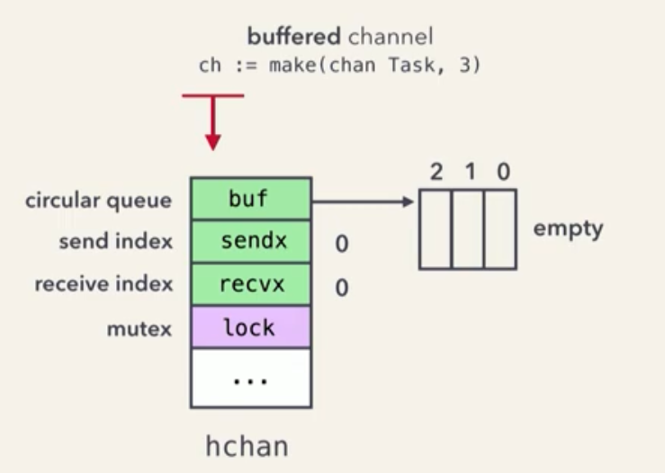
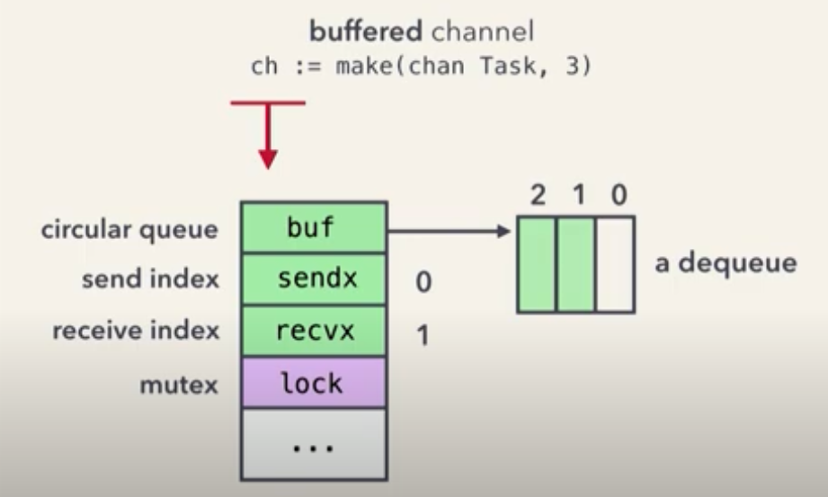
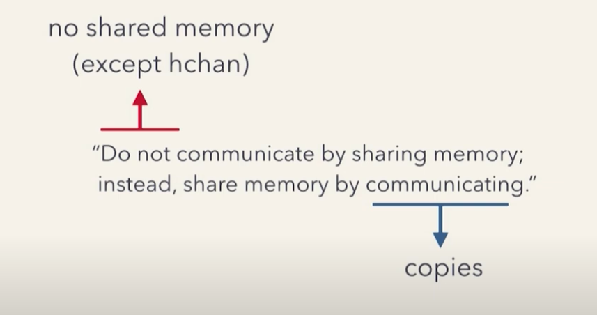
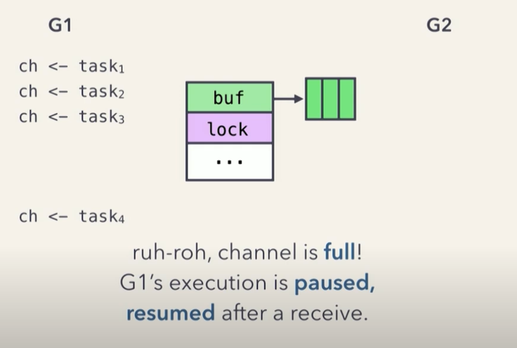
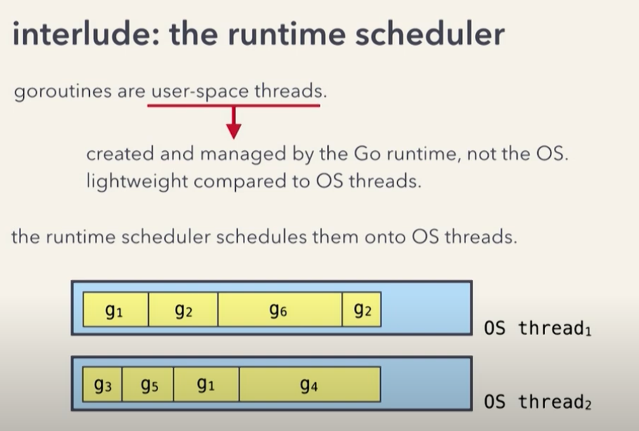
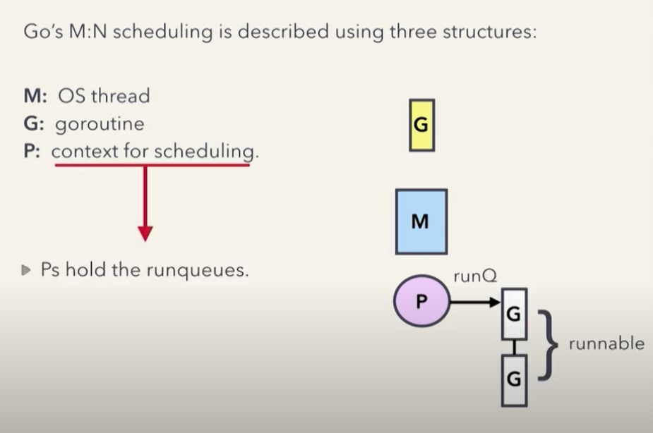
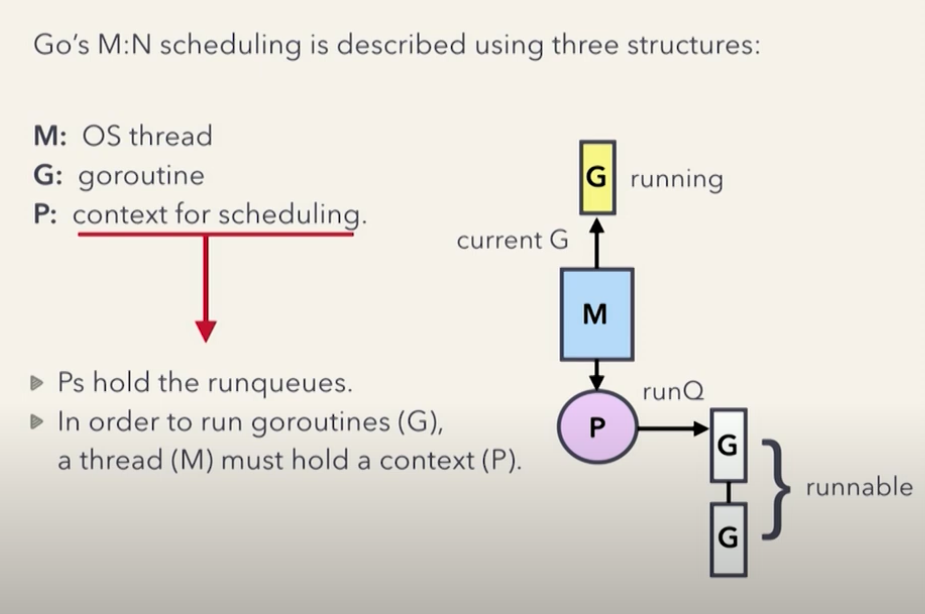
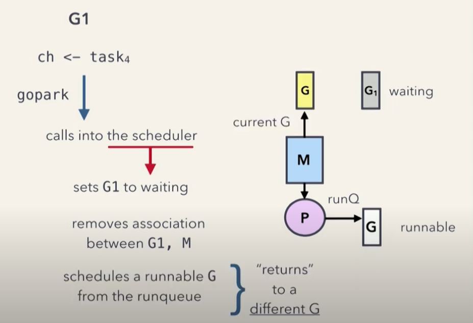
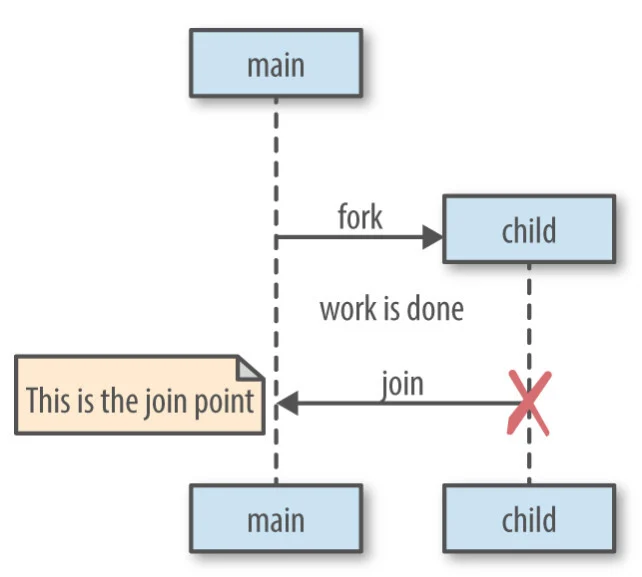

Concurrency is about MANAGING multiple task at once, parallelism is about EXECUTING multiple tasks at once

# Concurrency

- Program that can handler multiple task.
- Performing many tasks in a single CPU Core, create the illusion that tasks are progressing simultaneously, but really not

# Parallelism

- Simultaniean executions.
- Multiple task can be processed simultained, using multiples CPU cores.

# Channels
- goroutine-safe
- stores up to  capacity elements, and provides FIFO semantics
- send values between goroutines
- can cause them to block, unblock



- affter the first , sendx to 1
- when the channel is full, sendx to 0 again


- when you recive a message


```go
// buffered channel
ch := make(chan Tash, 3)

// unbuffered channel
ch := make(chan int)
```

The channels are stored in the heap, returns a pointer to it.<br />
This is why we can pass channels between functions, dont need to pass **pointers to channels**


<br />

<br />
(user-space threads) Goroutines are created and managed by the Go runtime, NOT the OS (os threads)
- user-space threads is less expensive with respecto to resource consumption and scheduling
- the runtime scheduler schedules them onto OS threads

<br />

<br />

<br />


## Capacity
```go 
make(chan *string, 20) // capatiyy of 20
```

affter the channel is closed we cant send anyrhing to the channel but we can recive values


https://www.youtube.com/watch?v=RlM9AfWf1WU&ab_channel=ByteByteGo

# Fork-Join Model

The Fork-Join model is a parallel programming pattern used to break a big task into smaller subtasks that can be done concurrently, and then combined to get the final result.

It’s widely used in divide-and-conquer algorithms, multithreading, and parallel processing.

## Fork
You split (fork) the main task into smaller, independent subtasks, and run them in parallel (e.g., using threads, goroutines, or processes).

## Join
You wait (join) until all the subtasks are done, then combine their results to produce the final output.

## Pattern
It's a pattern commonly used in parallel processing, like in divide-and-conquer algorithms (e.g. parallel mergesort, image processing, etc.)
<br />


## 🔍 Fork-Join Model vs Fork-Join Pool

- Can be mimicked in Go using goroutines + channels + worker pools


| Concept      | Fork-Join **Model**             | Fork-Join **Pool**                      |
|--------------|----------------------------------|------------------------------------------|
| What it is   | A pattern or strategy            | A system to implement the pattern        |
| Level        | High-level idea                  | Practical tool/framework                 |
| Example      | "Split task, run subtasks, join" | Java's `ForkJoinPool` class              |
| Usage        | Theory or any language           | Java or other specific platforms         |

---


- **Fork-Join model** is the recipe  
- **Fork-Join pool** is the kitchen appliance that makes it easier to cook that recipe

# Communicating Sequential Processes - CSP
It’s a formal way to describe how independent processes (tasks) communicate and coordinate with each other through channels.

- Each process runs sequentially (like a regular function).

- Processes don’t share memory.

- Instead, they communicate by sending messages through channels.

- Synchronization happens when one process sends a message and another receives it — they must "meet" at the channel.

```go
ch := make(chan string)

go func() {
    ch <- "hello" // sends data
}()

msg := <-ch // receives data
fmt.Println(msg)

// No shared memory.

// Communication is synchronized at the channel.

// If the receiver isn’t ready, the sender blocks, and vice versa.
```

2 main concepts: Synchronnization and Guarded Commands

## Synchronization
Synchronization means making sure that multiple threads or processes don’t step on each other’s toes — especially when accessing shared resources like variables or memory.

Why do we need it?
To avoid data races, inconsistencies, crashes, etc.

### Common synchronization tools:
- Locks / mutexes: Only one thread can access a resource at a time.

- Semaphores: Counted locks, controlling access to a pool of resources.

- Barriers: Threads wait until all reach a point.

- Channels (in CSP): Implicit synchronization through communication.

```go
let counter = Arc::new(Mutex::new(0));

let handle = thread::spawn({
    let counter = Arc::clone(&counter);
    move || {
        let mut num = counter.lock().unwrap(); // synchronized access
        *num += 1;
    }
});
```

## Guarded Commands
Used to control the execution flow in concurrent or non-deterministic programs.
A guard is a boolean condition (true or false) that controls whether a certain block of code can execute.

In CSP, you can model programs that wait on multiple possible inputs, and choose based on availability. For example:

```go
select {
case msg := <-ch1:
    // do something with msg
case msg := <-ch2:
    // do something else
}
```

This Go select statement is very much like guarded commands — each channel read is a guard, and only one case executes depending on which channel is ready.

- Each case waits only if the channel is ready.

- If multiple channels are ready, Go picks one at random → non-determinism.

- If no guards are true (no channels ready), the default acts like a "fallback guard". If we have a default

# Pool

sync.Pool in Go is a structure for efficiently reusing objects and reducing the overhead of repeatedly creating and destroying them.

- It's ideal when you need to create many temporary objects (like buffers, resources, etc.).

- Internally, sync.Pool maintains a set of ready-to-use objects.

- When you call Get(), it tries to give you an existing object.

    - If the pool is empty, it calls the New() function to create a new one.

- When you're done with an object, you call Put() to return it to the pool.

## What is sync.Pool
To put it simply, sync.Pool in Go is a place where you can keep temporary objects for later reuse.
<br />
But here’s the thing, you don’t control how many objects stay in the pool, and anything you put in there can be removed at any time, without any warning and you’ll know why when reading last section.
<br />
The good point is, the pool is built to be thread-safe, so multiple goroutines can tap into it simultaneously. Not a big surprise, considering it’s part of the sync package.
<br />
https://victoriametrics.com/blog/go-sync-pool/